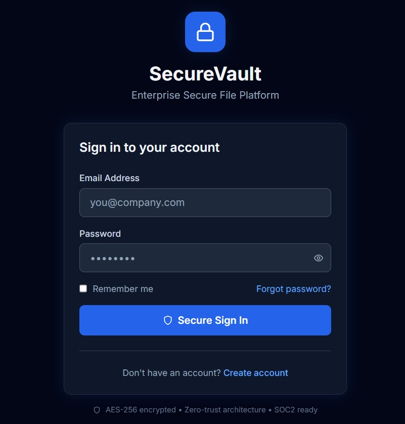
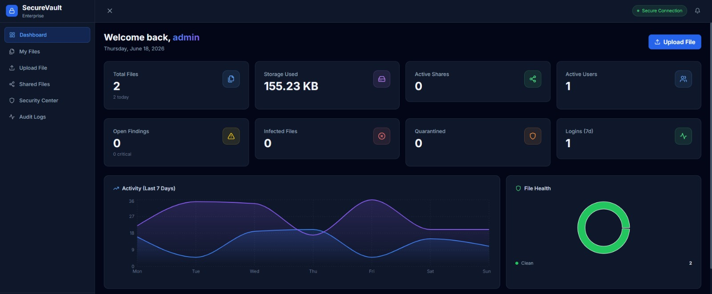
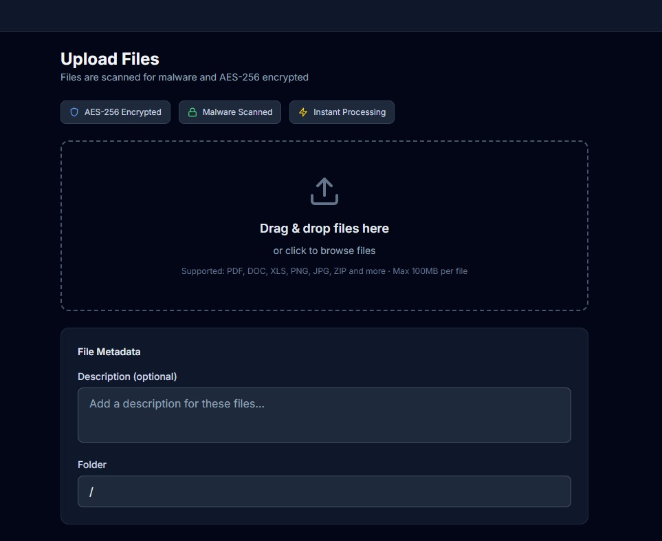
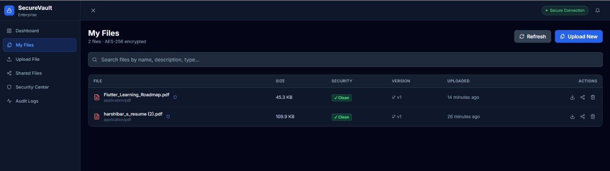
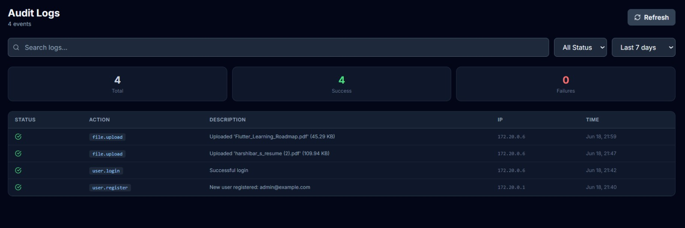
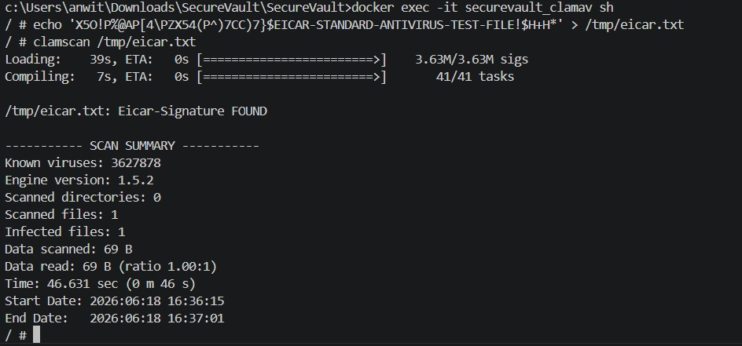

# 🔒 SecureVault

**Enterprise-Grade Secure File Sharing and Document Management Platform**
SecureVault is an enterprise-grade secure file sharing platform that combines AES-256 encryption, role-based access control, ClamAV malware scanning, audit logging, and secure share links into a unified document management system.

---

##  Live Demo

- Frontend: https://secure-vault-l1v6.vercel.app
- Backend API: https://securevault-backend-qsc5.onrender.com
- API Docs: https://securevault-backend-qsc5.onrender.com/api/docs

##  Quick Start

```bash
# Clone the repository
git clone <repo-url>
cd SecureVault

# Copy environment config
cp .env.example .env

# Start all services
docker compose up -d

# Access the platform
Visit http://localhost
```


---


##  Screenshots

###  Login Page



### Dashboard



###  File Upload



###  File Collection



###  Audit Logs



###  Malware Detection (ClamAV + EICAR Test)




##  Architecture

```
SecureVault/
├── frontend/          # React 18 + Tailwind CSS + Recharts
│   ├── src/
│   │   ├── pages/     # Login, Dashboard, Files, Security, etc.
│   │   ├── components/# Reusable UI components
│   │   ├── api/       # Axios client with JWT interceptors
│   │   └── context/   # Auth context provider
│   └── Dockerfile
│
├── backend/           # FastAPI + SQLAlchemy + Pydantic
│   ├── app/
│   │   ├── api/       # REST endpoints (auth, files, users, security)
│   │   ├── core/      # Config, DB, Security, JWT, AES-256
│   │   ├── models/    # SQLAlchemy ORM models
│   │   ├── schemas/   # Pydantic request/response schemas
│   │   └── services/  # Storage, Scanner, AI, Audit services
│   ├── tests/         # Pytest async tests
│   └── Dockerfile
│
├── database/          # PostgreSQL init scripts
├── docker-compose.yml # Full-stack orchestration
└── .env.example       # Environment template
```

---

##  Security Features

| Feature | Implementation |
|---------|---------------|
| File Encryption | AES-256-GCM per file |
| Password Hashing | bcrypt (cost factor 12) |
| Authentication | JWT (RS256, 30min expiry + refresh) |
| Authorization | RBAC (admin/manager/user/viewer) |
| Malware Scanning | ClamAV via TCP socket |
| Secure Sharing | Cryptographically random tokens |
| Share Limits | Expiry, download/view count caps |
| Password Links | bcrypt-hashed share passwords |
| Audit Logging | Every action logged with IP/UA |
| Security Headers | HSTS, CSP, XSS, Frame-Options |
| Rate Limiting | Per-IP request throttling |
| Account Lockout | 5 failures → 15min lock |

---

##  Database Schema

SecureVault uses PostgreSQL with dedicated tables for users, files, roles, share links, and audit logs.


##  API Reference

### Authentication
```
POST /api/v1/auth/register    - Create account
POST /api/v1/auth/login       - Login → JWT tokens
POST /api/v1/auth/refresh     - Refresh access token
POST /api/v1/auth/logout      - Logout
GET  /api/v1/auth/me          - Get current user
POST /api/v1/auth/password-change
POST /api/v1/auth/password-reset-request
POST /api/v1/auth/password-reset
```

### Files
```
POST   /api/v1/files/upload           - Upload + scan + encrypt
GET    /api/v1/files/                 - List my files
GET    /api/v1/files/search?q=...     - Full-text search
GET    /api/v1/files/{id}             - Get file metadata
GET    /api/v1/files/{id}/download    - Download (decrypted)
PUT    /api/v1/files/{id}             - Update metadata
DELETE /api/v1/files/{id}             - Soft delete
POST   /api/v1/files/{id}/share       - Create share link
GET    /api/v1/files/shared/links     - My share links
GET    /api/v1/files/share/{token}    - Access shared file
GET    /api/v1/files/share/{token}/download
GET    /api/v1/files/{id}/versions    - Version history
POST   /api/v1/files/{id}/version     - Upload new version
```

### Security & Admin
```
GET  /api/v1/security/dashboard       - Platform stats
GET  /api/v1/security/audit-logs      - All audit logs (admin)
GET  /api/v1/security/my-activity     - My activity log
GET  /api/v1/security/findings        - Security findings
POST /api/v1/security/findings        - Create finding
PUT  /api/v1/security/findings/{id}/resolve
POST /api/v1/security/files/{id}/quarantine
POST /api/v1/security/ai/analyze      - AI security analysis
POST /api/v1/security/ai/report       - Generate AI report
```

### Users
```
GET  /api/v1/users/          - List users (manager+)
GET  /api/v1/users/{id}      - Get user (manager+)
PUT  /api/v1/users/{id}      - Update user (admin)
DELETE /api/v1/users/{id}    - Deactivate (admin)
GET  /api/v1/users/roles/all - List roles (admin)
POST /api/v1/users/roles     - Create role (admin)
```
---

##  Docker Services

| Service | Port | Description |
|---------|------|-------------|
| frontend | 80, 3000 | React app via Nginx |
| backend | 8000 | FastAPI application |
| db | 5432 | PostgreSQL 15 |
| redis | 6379 | Redis 7 (caching) |
| clamav | 3310 | ClamAV antivirus |

---

##  Running Tests

```bash
# Backend tests
cd backend
pip install -r requirements.txt
pytest tests/ -v

# With coverage
pytest tests/ -v --cov=app --cov-report=html
```

---

## 🔧 Configuration

Key environment variables (see `.env.example`):

```env
JWT_SECRET_KEY=<random-32-char-string>
ENCRYPTION_KEY=<random-32-char-string>
DATABASE_URL=postgresql+asyncpg://...
STORAGE_BACKEND=local|s3
CLAMAV_ENABLED=true|false
```

---

##  Features Checklist

- JWT authentication with refresh tokens
- AES-256-GCM file encryption
- ClamAV malware scanning
- Role-based access control
- Secure share links with expiration controls
- File versioning and search
- Complete audit logging
- AI-powered security analysis
- Dockerized deployment

---

## Deployment

SecureVault is fully containerized using Docker and Docker Compose for reproducible local development and production deployments.

### Services

* Frontend: React + Nginx
* Backend: FastAPI
* Database: PostgreSQL
* Cache: Redis
* Malware Scanning: ClamAV

### Production Stack

* Frontend → Vercel
* Backend → Render
* Database → Neon PostgreSQL
* Redis → Render Redis


##  License

MIT License - see LICENSE file for details.

## Author 

Anwita Padhi

---

*Built with ❤️ for enterprise security*


